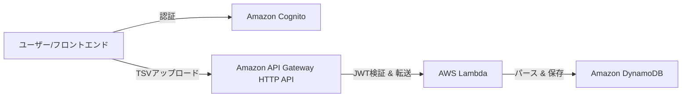

# Amazon Revenue Manager - TypeScript Lambda Backend

## アプリ概要
Amazon セルラー向けの決済レポート（TSV形式）を API Gateway 経由で受け取り、内容をパースして DynamoDB へ保存するサーバーレスアプリケーション。
**Amazon Cognito による認証**を導入しており、セキュアなアクセスを実現しています。

### システム構成図


---

## 1. デプロイ手順 (AWS SAM)

本プロジェクトは **AWS SAM** を使用して、Lambda、API Gateway、DynamoDB、Cognito を一括でデプロイします。

### ① 事前準備
1. **AWS SAM CLI のインストール**: [公式ガイド](https://docs.aws.amazon.com/ja_jp/serverless-application-model/latest/developerguide/install-sam-cli.html)に従いインストール。
2. **AWS CLI の認証設定**: `aws configure` でアクセスキー等を設定。

### ② ビルドとデプロイ
ターミナルで `backend-typescript-lambda` フォルダに移動し、以下のコマンドを実行します。

```bash
# 1. TypeScript のビルド (esbuild を使用)
npm run build

# 2. SAM によるパッケージ化
sam build

# 3. AWS へのデプロイ (初回のみ --guided を付与)
sam deploy --guided
```

デプロイが完了すると、ターミナルの最後に **Outputs** というセクションが表示されます。そこに以下の 3 つの値が表示されるので、必ずメモしておいてください。

| Output Key | 説明 |
| :--- | :--- |
| **ApiEndpoint** | API Gateway のベース URL。フロントエンドの API 接続先になります。 |
| **UserPoolId** | Cognito ユーザープールの ID。フロントエンドの認証設定に使用します。 |
| **UserPoolClientId** | Cognito アプリクライアントの ID。フロントエンドの認証設定に使用します。 |

---

## 2. デプロイ後の必須設定

### ① フロントエンド (Vue.js) の設定更新
`frontend-vue/src/main.ts` に、デプロイ結果の値を反映させてください。

```typescript
Amplify.configure({
  Auth: {
    Cognito: {
      userPoolId: 'ap-northeast-1_XXXXXXXXX', // UserPoolId
      userPoolClientId: 'XXXXXXXXXXXXXXXXXXXXXXXXXX', // UserPoolClientId
    }
  },
  API: {
    REST: {
      AmzRevenueApi: {
        endpoint: 'https://XXXXXXXXXX.execute-api.ap-northeast-1.amazonaws.com', // ApiEndpoint
      }
    }
  }
});
```

### ② Cognito ユーザーの作成
アプリを利用するために、以下のいずれかでユーザーを作成してください。
- **サインアップ**: フロントエンドのログイン画面の「Create Account」から。
- **AWS コンソール**: Cognito > ユーザープール > `AmzRevenueUserPool` > ユーザーの作成。

---

## 3. 開発・テスト方法

### ① REST Client (file-upload.http) でのテスト
認証が有効な API をテストするには、ID トークンが必要です。

1. **ID トークンの取得 (AWS CLI)**:
   ```powershell
   aws cognito-idp initiate-auth `
     --auth-flow USER_PASSWORD_AUTH `
     --client-id <UserPoolClientId> `
     --auth-parameters USERNAME=<メールアドレス>,PASSWORD=<パスワード> `
     --query "AuthenticationResult.IdToken" `
     --output text
   ```
2. **トークンのセット**:
   取得したトークンを `api-test/file-upload.http` の `authToken` 変数に貼り付けて実行してください。

### ② ログの確認
- **CloudWatch Logs**: Lambda の `console.log` 出力やエラー内容は、CloudWatch Logs の `/aws/lambda/Amazon-Revenue-Manager-...` から確認できます。
