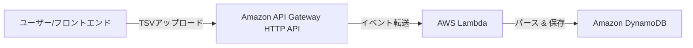

# Amazon Revenue Manager - TypeScript Lambda Backend

## アプリ概要
Amazon セルラー向けの決済レポート（TSV形式）を API Gateway 経由で受け取り、内容をパースして DynamoDB へ保存するサーバーレスアプリケーション。

### システム構成図


### 処理フロー
1.  **トリガー**: ユーザーが API Gateway のエンドポイントに対して、決済レポート（TSV）を `multipart/form-data` 形式で POST。
2.  **実行**: API Gateway が Lambda 関数を起動。
3.  **パース**: Lambda 内で `busboy` を使用してファイルを抽出し、`csv-parse` で TSV 内容をオブジェクト化。
    - 2行目のサマリー行をスキップし、3行目以降の明細を抽出。
4.  **DB保存**: 抽出した明細データを DynamoDB の `Settlements` テーブルに保存。
    - `settlementId` をパーティションキー、パース時に生成した連番（`lineId`）をソートキーとして使用。

---

## 1. DynamoDB テーブルの作成
決済情報保存用のテーブル作成。

1. DynamoDB コンソールに移動し、「テーブルの作成」をクリック。
2. **テーブル名**: `Settlements`
3. **パーティションキー**: `PK` (文字列) ※内部で `settlementId` を格納
4. **ソートキー**: `SK` (文字列) ※内部で `lineId` (L1, L2...) を格納
5. 他の設定はデフォルトのまま「テーブルの作成」をクリック。

---

## 2. API Gateway (HTTP API) の作成
Lambda 呼び出し用のエンドポイント作成。

1. API Gateway コンソールに移動し、「API を作成」をクリック。
2. **HTTP API** の「構築」をクリック。
3. **統合を追加**: 「Lambda」を選択し、デプロイ済みの関数を選択。
4. **API 名**: `AmzRevenueApi`
5. **ルートの設定**:
    - メソッド: `POST`
    - リソースパス: `/sales/upload`
    - (追加) メソッド: `GET`
    - (追加) リソースパス: `/sales/summary`
6. **CORS 設定**:
    - 「設定」>「CORS」から、フロントエンドのドメイン（開発時は `*`）を許可。

---

## 3. デプロイ手順 (AWS SAM)

本プロジェクトは **AWS SAM (Serverless Application Model)** を使用してデプロイします。Windows 環境でのビルドエラーを避けるため、`esbuild` による手動ビルド方式を採用しています。

### ① 事前準備
1. **AWS SAM CLI のインストール**: [公式ガイド](https://docs.aws.amazon.com/ja_jp/serverless-application-model/latest/developerguide/install-sam-cli.html)に従いインストール。
2. **AWS CLI の認証設定**: `aws configure` でアクセスキー等を設定。

### ② ビルドとデプロイ
ターミナルで `backend-typescript-lambda` フォルダに移動し、以下のコマンドを実行します。

```bash
# 1. TypeScript のビルド (esbuild を使用して dist フォルダに出力)
npm run build

# 2. SAM によるパッケージ化
sam build

# 3. AWS へのデプロイ (初回のみ --guided を付与)
sam deploy --guided
```

### ③ `sam deploy --guided` での主な設定項目
- **Stack Name**: `amz-revenue-manager-backend` (任意)
- **AWS Region**: `ap-northeast-1` (東京)
- **Allow SAM CLI IAM role creation**: `Y` (必須)
- **Disable rollback**: `Y` (デバッグ時は推奨)
- **... has no authentication. Is this okay?**: `y` (開発時は OK)

---

## 4. ログとデータの確認

### ① Lambda の実行ログ確認
1. Lambda コンソールの「モニタリング」タブから「CloudWatch のログを表示」をクリック。
2. `Processing file: ...` や `Parsed X settlement records` のメッセージを確認。

### ② DynamoDB のデータ確認
1. DynamoDB コンソールで `Settlements` テーブルを選択。
2. 「テーブルアイテムの探索」をクリック。
3. 保存された明細データを確認。

---

## 5. デプロイ時の注意点

### ① Lambda の環境変数設定
Lambda 関数の設定画面で、以下の環境変数を設定してください。
- `SETTLEMENT_TABLE_NAME`: `Settlements` (作成した DynamoDB テーブル名)
- `DEBUG`: `true` (開発時のみ。エラー時に詳細なスタックトレースを返します)

### ② Lambda のタイムアウト設定
デフォルトの 3秒では、大きなレポート（数百行以上）の処理中にタイムアウトする可能性があります。
- **推奨設定**: 30秒 〜 1分程度に延長してください。

### ③ IAM ロールの権限設定
Lambda 関数に付与されている IAM ロールに、以下の権限を追加してください。
- `dynamodb:PutItem` (対象: `Settlements` テーブルの ARN)
- `logs:CreateLogGroup`, `logs:CreateLogStream`, `logs:PutLogEvents` (CloudWatch Logs 出力用)

### ④ バイナリメディアタイプの許可 (重要)
API Gateway で `multipart/form-data` を正しく扱うために、以下の設定が必要です。
- **REST API の場合**: 「設定」>「バイナリメディアタイプ」に `multipart/form-data` を追加。
- **HTTP API の場合**: デフォルトでペイロードが base64 エンコードされて Lambda に渡されるため、コード側での対応（現在の実装で対応済み）で動作します。
