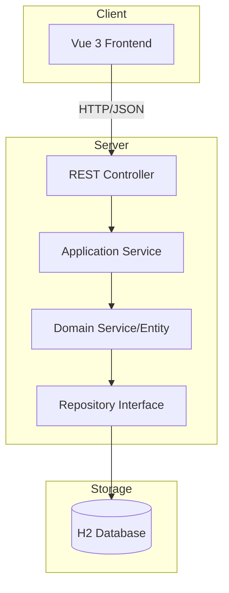

# システム全体アーキテクチャ

## 1. 概要
本システムは、Amazonの各種レポート（決済、広告、販売日管理）をアップロードし、親SKU単位での月次収益を自動集計・管理するアプリケーションです。

## 2. 技術スタック

### フロントエンド
- **フレームワーク**: Vue 3 (Composition API)
- **ビルドツール**: Vite
- **言語**: TypeScript
- **ルーティング**: Vue Router
- **HTTPクライアント**: Axios
- **UIスタイル**: CSS Variablesを用いたカスタムスタイル（レスポンシブ対応）

### バックエンド
- **フレームワーク**: Spring Boot 3
- **言語**: Java 17+
- **ビルドツール**: Maven
- **データベース**: H2 Database (開発/検証用)
- **ORM**: Spring Data JPA

## 3. ディレクトリ構造

```text
AmzRevenueManager-1/
├── backend/             # Spring Boot, Java, Maven
│   ├── src/
│   ├── pom.xml
│   └── ...
├── frontend-react/      # React version
├── frontend-vue/        # Vue version
├── docs/                # Design documents
└── .gitignore           # Global gitignore
```

## 4. システム構成図



## 4. 主要なデータフロー

### 4.1 レポートアップロード・集計フロー
1. ユーザーがフロントエンドからCSV/TSVファイルをアップロード。
2. `FileUploadController` がリクエストを受け取り、`SettlementImportService` 等へ渡す。
3. ファイルが解析され、`Settlement` エンティティとしてデータベースに保存される。
4. 保存後、`MonthlyRevenueSummaryService` がデータを集計し、親SKUごとの収益を算出する。

### 4.2 収益サマリー表示フロー
1. ユーザーが「月別サマリー」ページにアクセス。
2. フロントエンドが `/api/monthly-summary` をコール。
3. バックエンドがデータベースから集計データを取得し、階層構造のDTOに変換して返却。
4. フロントエンドがテーブル形式でデータをレンダリング。
