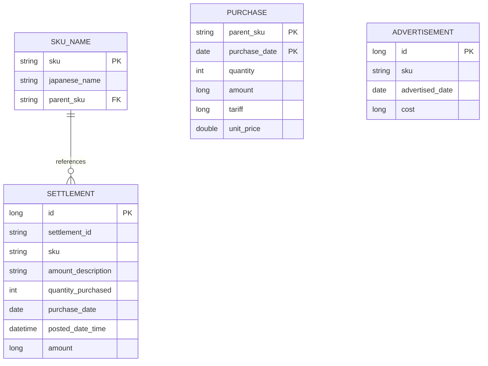

# データベース設計

## 1. 概要
本システムでは、Amazonのレポートデータを永続化し、集計を行うためのテーブルを保持しています。
開発環境では H2 Database (In-Memory/File) を使用しています。

## 2. エンティティ関係図 (ER図)

## 3. テーブル定義

### 3.1 SKU_NAME (SKU名管理)
SKUと日本語名、および親SKUの階層構造を管理します。

| カラム名 | 型 | 説明 |
| :--- | :--- | :--- |
| sku | VARCHAR(255) | 最小単位のSKU (主キー) |
| japanese_name | VARCHAR(255) | 表示用の日本語名 |
| parent_sku | VARCHAR(255) | 親SKU（自分自身が親の場合はNULLまたは特定の値） |

### 3.2 PURCHASE (仕入れ情報)
親SKUごとの仕入れコストを管理します。

| カラム名 | 型 | 説明 |
| :--- | :--- | :--- |
| parent_sku | VARCHAR(255) | 親SKU (複合主キー1) |
| purchase_date | DATE | 仕入れ日 (複合主キー2) |
| quantity | INT | 仕入れ数量 |
| amount | BIGINT | 仕入れ総額 |
| tariff | BIGINT | 関税 |
| unit_price | DOUBLE | 算出された単価 |

### 3.3 SETTLEMENT (決済データ)
Amazonペイメントレポートからインポートされた生データ。

### 3.4 ADVERTISEMENT (広告データ)
広告レポートからインポートされたSKUごとの広告費データ。
